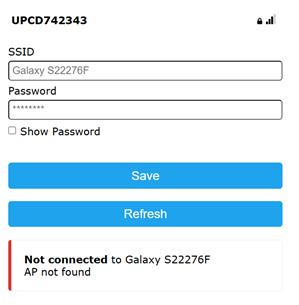
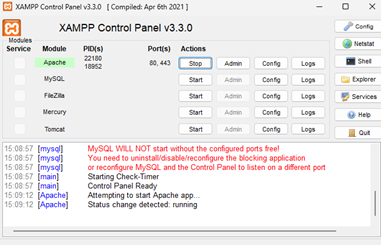
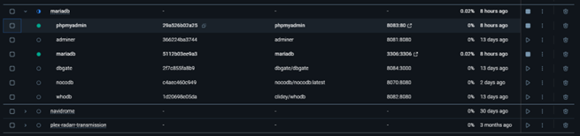
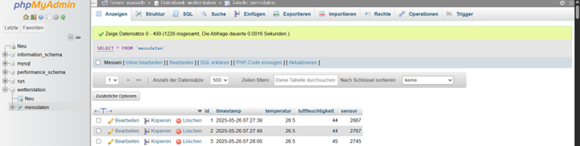
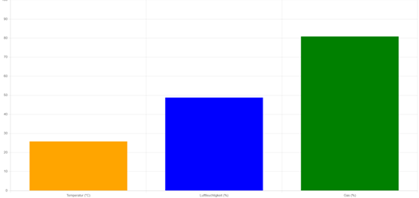
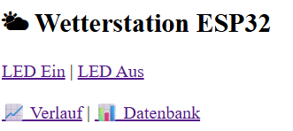

# 🌦 WETTERSTATION

**Kilian Bayer & Patrick Jeschko**

## 📑 Inhalt

1. [Einführung](#1-einf%C3%BChrung)
2. [Projektbeschreibung](#2-projektbeschreibung)
3. [Theorie](#3-theorie)
4. [Arbeitsschritt – Technische Umsetzung](#4-arbeitsschritt--technische-umsetzung)

   * [1. Aufbau der Hardware](#1-aufbau-der-hardware)
   * [2. Verbindung mit dem WLAN](#2-verbindung-mit-dem-wlan)
   * [3. Erfassung und Speicherung der Messwerte](#3-erfassung-und-speicherung-der-messwerte)
   * [4. Visualisierung im Webinterface](#4-visualisierung-im-webinterface)
   * [5. Automatische RGB-LED Statusanzeige](#5-automatische-rgb-led-statusanzeige)
5. [Zusammenfassung](#5-zusammenfassung)
6. [Quellen](#6-quellen)
7. [Abbildungsverzeichnis](#6-abbildungsverzeichnis)

---

## 1. Einführung

Das Ziel dieses Projekts war es, eine einfache Wetterstation mit einem ESP32-C3 Mikrocontroller zu entwickeln. Dabei sollten Messwerte wie Temperatur, Luftfeuchtigkeit und Gasgehalt erfasst, gespeichert und über ein Webinterface dargestellt werden. Zusätzlich sollte eine LED den aktuellen Systemstatus farblich anzeigen, um jederzeit eine visuelle Rückmeldung zum Systemzustand zu geben.

## 2. Projektbeschreibung

Im Projekt wurde eine Wetterstation aufgebaut, die regelmäßig Messdaten über Sensoren erfasst. Diese werden an einen lokalen Webserver gesendet, in einer MySQL-Datenbank gespeichert und im Webinterface sowohl als Tabelle als auch in einem einfachen Balkendiagramm angezeigt. Die RGB-Status-LED zeigt automatisch den aktuellen Zustand an. Ein ursprünglich geplanter RGB-Colorpicker zur manuellen Steuerung der LED konnte wegen zu wenig Speicherplatz auf dem ESP32-C3 nicht erfolgreich umgesetzt werden.

## 3. Theorie

Für das Projekt wurde ein ESP32-C3 Mikrocontroller verwendet. Der verbaute DHT11-Sensor misst Temperatur und Luftfeuchtigkeit, ein analoger Gassensor den Luftgehalt. Die erfassten Werte wurden über HTTP an ein PHP-Skript (insert.php) auf einem XAMPP-Webserver gesendet und dort in eine relationale MySQL-Datenbank eingetragen.
Zur Visualisierung wurde die JavaScript-Bibliothek Chart.js verwendet. Die letzten fünf Messungen wurden gespeichert und anschließend wurde pro Messgröße (Temperatur, Luftfeuchtigkeit, Gas) ein Durchschnittswert berechnet. Diese drei Durchschnittswerte werden im Webinterface in einem Balkendiagramm dargestellt. So erhält man einen schnellen Überblick über den aktuellen Verlauf der letzten Messwerte.

Die eingebaute RGB-LED (NeoPixel) zeigt den aktuellen Status farblich an:

* Blau: Messung aktiv
* Orange: Temperatur über 30 °C
* Rot: Kein WLAN
  Über das Webinterface lässt sich die LED auch vollständig deaktivieren.

## 4. Arbeitsschritt – Technische Umsetzung

### 1. Aufbau der Hardware

Der ESP32-C3 Mikrocontroller wurde mit zwei Sensoren verbunden: ein DHT11-Sensor für Temperatur und Luftfeuchtigkeit (angeschlossen an PIN 9) sowie ein analoger Gassensor (an PIN 2). Für die Statusanzeige wurde die interne RGB-LED (NeoPixel) verwendet.

```cpp
#define DHT11_PIN 9
#define GAS_PIN 2
#define LED_PIN 8
DHT dht11(DHT11_PIN, DHT11);
Adafruit_NeoPixel led(1, LED_PIN, NEO_GRB + NEO_KHZ800);
```

### 2. Verbindung mit dem WLAN

Die Bibliothek WiFiManager wurde verwendet, um automatisch eine Verbindung zu einem bekannten WLAN herzustellen oder bei Fehlschlag ein Konfigurationsportal zu öffnen (Access Point 'WetterstationAP'). Das Endgerät muss sich im selben Netzwerk befinden, damit das Webinterface erreichbar ist.



**Abbildung 1: WetterstationAP; WifiManager**

```cpp
WiFiManager wifiManager; // Objekt zum Verwalten der WLAN-Verbindung
if (wifiManager.autoConnect("WetterstationAP")) {
    Serial.println("✅ WLAN verbunden: " + WiFi.localIP().toString());
}
```

### 3. Erfassung und Speicherung der Messwerte

Alle 10 Sekunden werden Temperatur, Luftfeuchtigkeit und Gaswert gemessen. Die Werte werden in Arrays gespeichert, wobei jeweils nur die letzten fünf Werte behalten werden. Zusätzlich werden sie als JSON an ein PHP-Skript (insert.php) gesendet, dass die Werte in eine MySQL-Datenbank schreibt. Die läuft lokal über MariaDB (phpmyadmin) und mit den Admin login-daten (root, example) kann man sich dort anmelden. Die Datenbank wird generell über Docker betrieben.



**Abbildung 2: Apache-Server; XAMPP**



**Abbildung 3: MariaDB über Docker**



**Abbildung 4: phpMyAdmin; Login: root, example**

```cpp
float t = dht11.readTemperature();
float h = dht11.readHumidity();
int rawGas = analogRead(GAS_PIN);
float gasPercent = rawGas / 4095.0 * 100.0;

tempHistory[tempIndex] = t;
humiHistory[tempIndex] = h;
gasHistory[tempIndex] = gasPercent;
tempIndex = (tempIndex + 1) % MAX_POINTS;

HTTPClient http;
http.begin("http://192.168.130.122/insert.php");
http.addHeader("Content-Type", "application/json");

String json = "{\"temperatur\":" + String(t) + ",\"luftfeuchtigkeit\":" + String(h) + ",\"sensor\":" + String(gasPercent) + "}";

http.POST(json);
http.end();
```

### 4. Visualisierung im Webinterface

Die letzten fünf Messwerte werden im Webinterface grafisch in einem Balkendiagramm dargestellt. Zusätzlich gibt es Links zur Datenbank (daten.php) und zur LED-Steuerung.



**Abbildung 5: Balkendiagramm; Webinterface**

```html
<script>
  async function fetchData() {
    const res = await fetch('/daten');
    const data = await res.json();
    const ctx = document.getElementById('chart').getContext('2d');
    new Chart(ctx, {
      type: 'bar',
      data: {
        labels: ['Temperatur (°C)', 'Luftfeuchtigkeit (%)', 'Gas (%)'],
        datasets: [{
          label: '⌄ Durchschnitt der letzten 5 Werte',
          data: [data.temperatur, data.luftfeuchtigkeit, data.gas],
          backgroundColor: ['orange', 'blue', 'green']
        }]
      },
      options: {
        scales: {
          y: { beginAtZero: true, max: 100 }
        }
      }
    });
  }
  fetchData();
</script>
```

### 5. Automatische RGB-LED Statusanzeige

Die interne RGB-LED leuchtet abhängig vom aktuellen Zustand:

* Kein WLAN → Rot
* Temperatur > 30 °C → Orange
* Normalbetrieb → Blau
  Die LED kann über das Webinterface ein- und ausgeschaltet werden.



**Abbildung 6: LED ein/aus; Webinterface**

```cpp
void updateLED(float t) {
  if (ledEnabled) {
    if (WiFi.status() != WL_CONNECTED) {
      led.setPixelColor(0, led.Color(255, 0, 0));
    } else if (t > 30) {
      led.setPixelColor(0, led.Color(255, 100, 0));
    } else {
      led.setPixelColor(0, led.Color(0, 0, 255));
    }
  } else {
    led.setPixelColor(0, 0);
  }
  led.show();
}
```

## 5. Zusammenfassung

Das Projekt „Wetterstation“ wurde erfolgreich umgesetzt. Die Messdaten wurden zuverlässig über WLAN an den Server übermittelt und korrekt in der Datenbank gespeichert. Die RGB-LED zeigte den aktuellen Systemstatus wie gewünscht an.

Ursprünglich war vorgesehen, einen RGB-Colorpicker zu integrieren, mit dem die LED manuell steuerbar wäre. Dieser musste jedoch aus Speicherplatzgründen verworfen werden, da der ESP32-C3 nicht genügend Ressourcen zur Darstellung und Verarbeitung der Farbauswahl bot.

Die finale Lösung zeigte automatisch den Betriebsstatus über die LED und erlaubte eine Deaktivierung über das Webinterface. Das Diagramm wurde zu einem übersichtlichen Balkendiagramm umgebaut, das den Durchschnitt der letzten 5 Messwerte je Messgröße anzeigt. Die gesamte Wetterstation ist somit einfach bedienbar, verständlich aufgebaut und funktional.

## 6. Quellen

1. Adafruit NeoPixel Library – [https://github.com/adafruit/Adafruit\_NeoPixel](https://github.com/adafruit/Adafruit_NeoPixel)
2. Chart.js – [https://www.w3schools.com/js/js\_graphics\_chartjs.asp](https://www.w3schools.com/js/js_graphics_chartjs.asp)
3. ESP32 Arduino Core – [https://github.com/espressif/arduino-esp32](https://github.com/espressif/arduino-esp32)
4. WiFiManager – [https://github.com/tzapu/WiFiManager](https://github.com/tzapu/WiFiManager)
5. DHT Sensor Library – [https://github.com/adafruit/DHT-sensor-library](https://github.com/adafruit/DHT-sensor-library)
6. IEEE Citation Guide – [https://ieeeauthorcenter.ieee.org/wp-content/uploads/IEEE-Reference-Guide.pdf](https://ieeeauthorcenter.ieee.org/wp-content/uploads/IEEE-Reference-Guide.pdf)
7. OpenAI – [https://openai.com/de-DE/](https://openai.com/de-DE/)

## 6. Abbildungsverzeichnis

Abbildung 1: WetterstationAP; WifiManager
Abbildung 2: Apache-Server; XAMPP
Abbildung 3: MariaDB über Docker
Abbildung 4: phpMyAdmin; Login: root, example
Abbildung 5: Balkendiagramm; Webinterface
